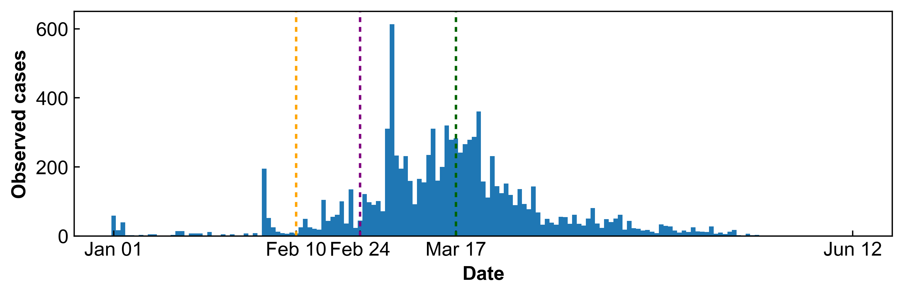
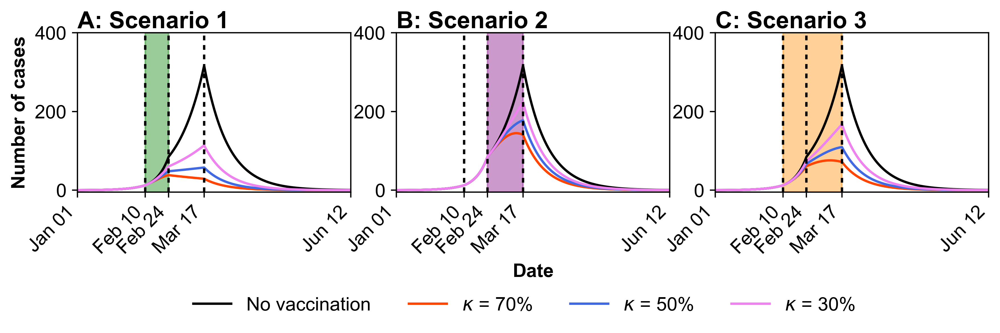

# Effective strategies for Typhoid Conjugate Vaccine Delivery: Health and Economic Insights from the 2015 Kampala Outbreak (2025)

The paper can found here: https://journals.plos.org/plosntds/article?id=10.1371/journal.pntd.0013566

## 1. Data

The dataset includes approximately 10,000 suspected typhoid cases, with a smaller number of probable and confirmed cases. Although it lacks information on mortality or complications, it captures the outbreak’s temporal progression, making it useful for model validation.

- Duration: January, 2015 - June, 2015 (daily)
- Region: Kampala, Uganda
- Critical time points
    1. **Start of investigation (February 10, 2015/yellow line)**: A typhoid-related death was first reported, prompting the Ugandan government to launch an official investigation [35].
    2. **Uganda notices typhoid outbreaks to WHO (February 24, 2015/ purple line)**: The outbreak was formally reported to the World Health Organization (WHO) [41].
    3. **WHO reports about typhoid outbreak in Uganda (March 17, 2015/green line)**: The WHO subsequently issued an official situation report [41].
- Time intervals
    - P1: January 1 - February 9, 2015
    - P2: February 10 - February 23, 2015
    - P3: February 24 - March 16, 2015
    - P4: March 17, 2015 - June 12, 2015
      

## 2. Vaccine Scenario

The relevant materials are provided in this repository and can be found in the **“Vaccine scenarios.xlsx”** and the **“Vaccine figure.ipynb”**.

- Scenario 1: Early
    - Vaccination during P2 (February 10 to February 24, 2015)
- Scenario 2: Late
    - Vaccination during P3 (February 24 to March 17, 2015)
- Scenario 3: Combined
    - Vaccination during P2+P3 (February 10 to March 17, 2015)

